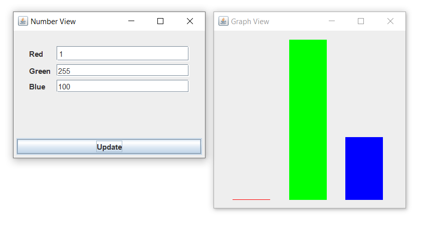
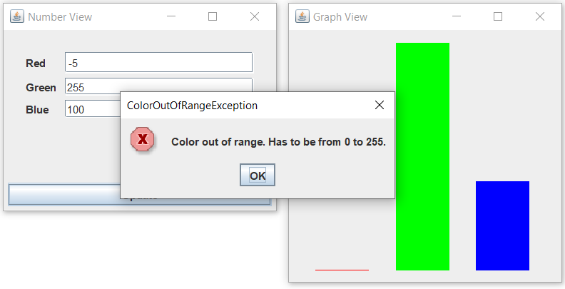
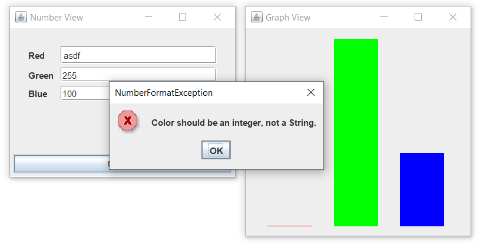

# Filter-and-Graph-Homework

CS-151 HW3, exercises 1 and 2. Student - Ahror Abdulhmaidov.


## Exercise 1 - Filter

To run, open **cmd** in the project folder and run the command (Java version – 11):
```bash
java -jar exercise1.jar
```
The output of the exercise 1:
```java
Original Arrays:
[Endor, Luke Hunter, Princess Kiara, Amidalus, Daedalus, Shadow King, Bale Prime, Lin Quan]
[-1, 0, 2, -7, -5, 6, -8, 9, -3, 4]

Filtered Arrays:
[Luke Hunter, Princess Kiara, Shadow King, Bale Prime]
[0, 2, 6, 9, 4]
```

## Exercise 2 - Graph

To run, double click the **exercise2.jar** file. The screenshots:






